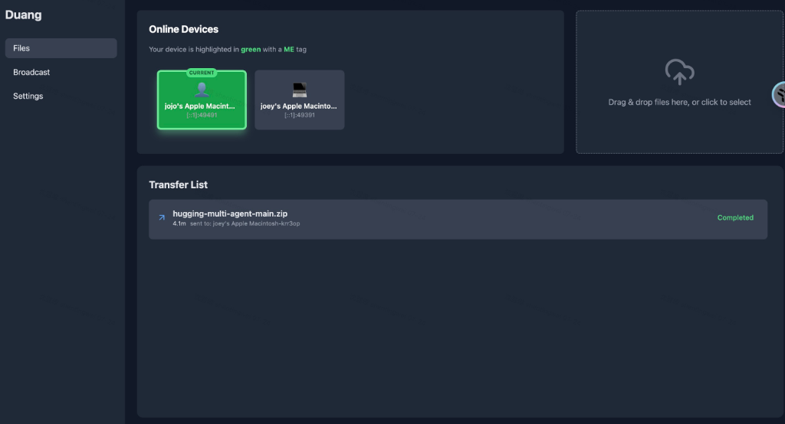
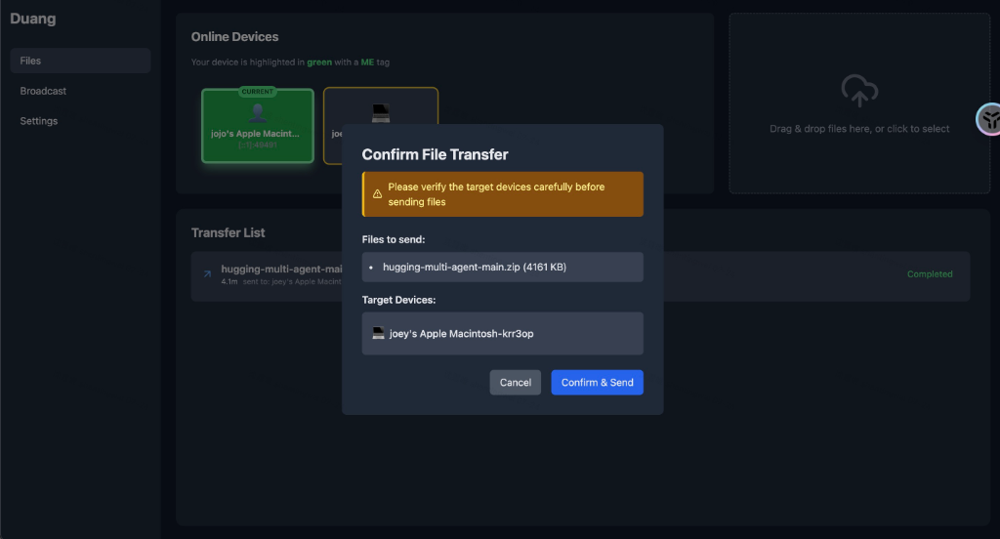
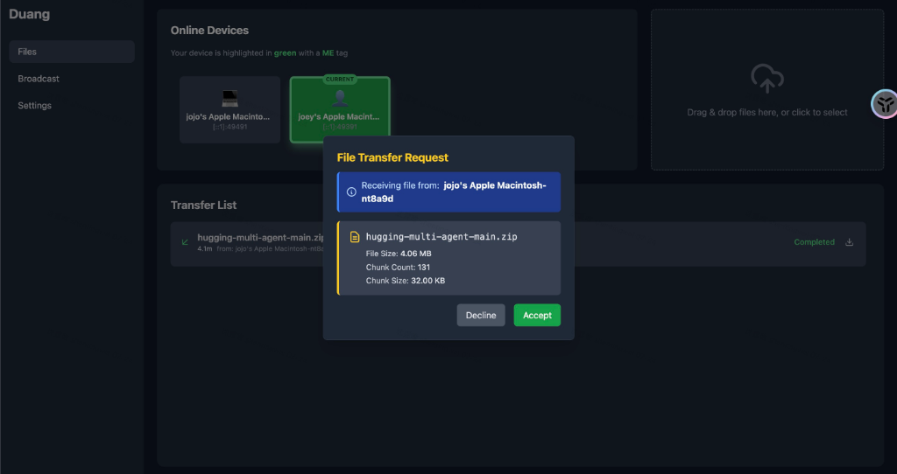
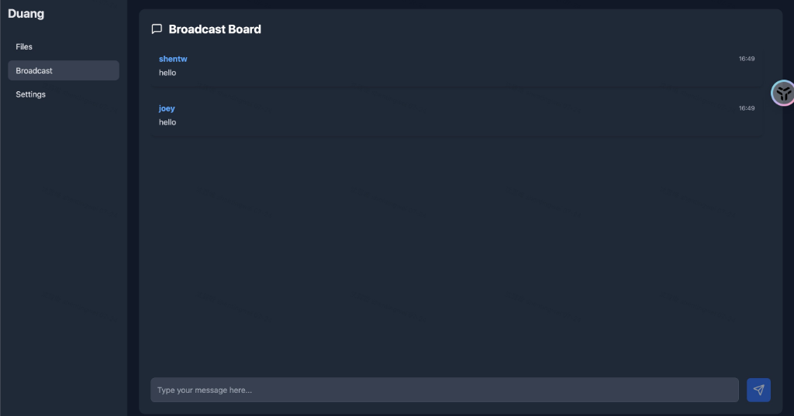
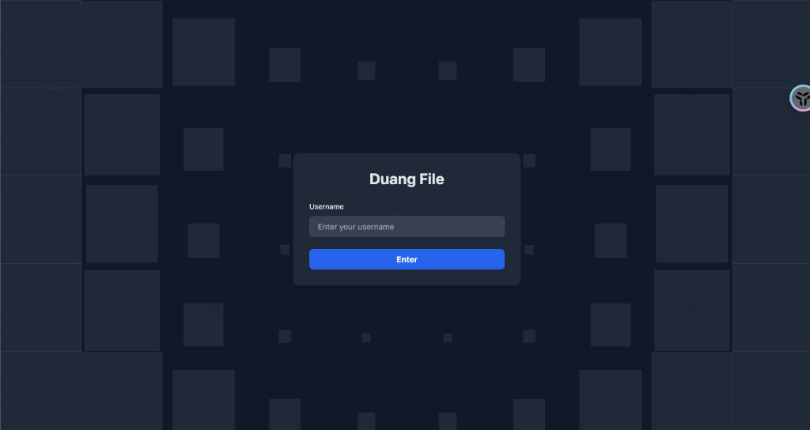

# Duang File Web - 局域网文件传输工具前端

## 概述

后端仓库地址: [duang_file](https://github.com/Waiting-Chai/duang_file)

这是一个React前端应用，使用Vite构建，支持登录、文件传输、客户端列表和广播消息。集成WebSocket与后端通信，实现实时文件传输和群聊。

## 安装
1. 确保安装Node.js (推荐18+)。
2. 克隆仓库。
3. 运行 `npm install` 安装依赖。

## 运行
- 执行 `npm run dev` 启动开发服务器于端口5173。
- 访问 http://localhost:5173 查看应用。

## 页面和功能
- **登录页面 (/login)**: 输入用户名登录，支持动画效果。操作：输入用户名，点击登录。
- **主页 (/)**: 显示客户端列表和文件传输界面。操作：选择客户端，上传/下载文件。
- **广播页面 (/broadcast)**: 群聊界面，支持发送和接收消息。操作：输入消息，发送；新消息以动画显示，并支持浏览器通知。

## 部署
### Docker部署
1. 构建镜像：`docker build -t duang-frontend .`
2. 运行容器：`docker run -d -p 5173:80 --name duang-frontend duang-frontend`

或使用 deploy.sh 脚本：`./deploy.sh`

## 项目结构
```
src/
├── features/
│   ├── login/         # 登录页面
│   ├── home/          # 主页
│   └── broadcast/     # 广播页面
├── api/               # API和Socket服务
├── components/        # 通用组件
└── types/             # 类型定义
```

更多细节见代码注释。

## 应用截图

### 主界面


### 文件发送确认


### 文件接收请求


### 广播消息


### 登录页面

